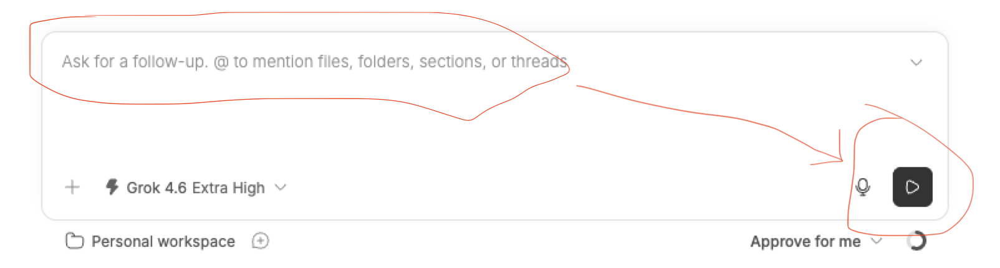

<p align="center">
  <h3 align="center">Nudge for <a href="https://getbb.app/">BB</a></h3>
  <p align="center">
    Replaces Send on an empty composer with Play, so the agent continues without a user message.
    <br><br>
    
    <a href="https://github.com/e-simpson/bb-plugin-nudge"></a>
  </p>
</p>



### Features
- ▶️ Play replaces Send while the composer draft is empty
- 🙈 Hidden continuation on idle threads — no `Continue.` bubble in the timeline
- 🔁 Failed turns retry by reference, like `bb thread retry`
- 🛑 Hidden while the agent is running, so Stop owns the row
- ⌨️ `bb nudge` from a terminal or agent shell

### Install via BB
1. Open BB
2. Plugins → search **Nudge** → Install

Or from a terminal:

```bash
bb plugin install git:https://github.com/e-simpson/bb-plugin-nudge.git@semver:^0.1.0
```

### Manual Installation
1. Clone this repository
2. `cd bb-plugin-nudge`
3. `npm install --include=dev`
4. `bb plugin install . --yes`

### Usage
Leave the composer empty and press Play. Typing brings Send back.

From a terminal, inside a BB thread:

```bash
bb nudge
```

Target another thread, or explain a retry:

```bash
bb nudge thr_abc123
bb nudge thr_abc123 --reason "transient provider overload" --json
```

`--message` is optional and visible. The default idle nudge stays hidden.

### What it does
- **Idle thread:** starts a turn with an agent-only continuation (no user bubble)
- **Errored thread:** retries the failed turn by reference (no new bubble)
- **Busy thread:** refused until the thread settles

No account, API key, or network access.

### License
MIT
